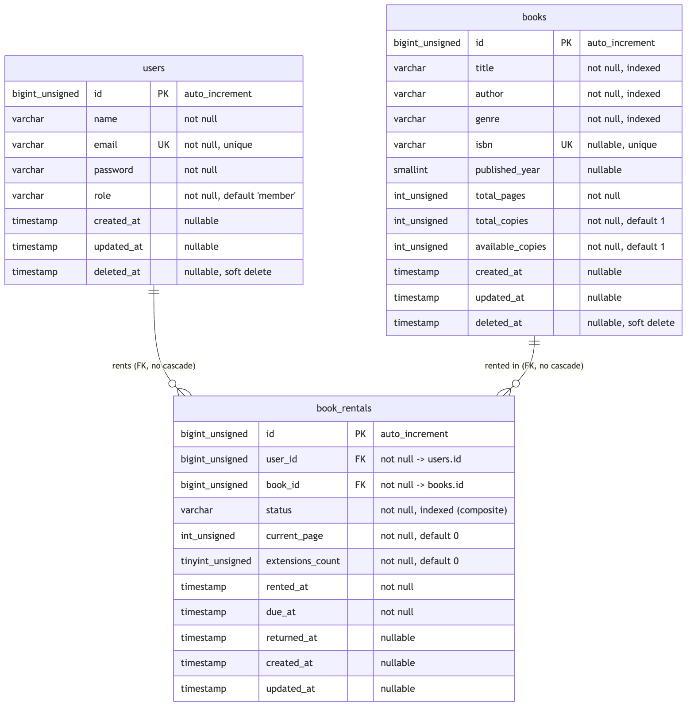

# Book Rental

A small book rental system for a library. Members browse a book catalogue, rent a book, track their
reading progress, extend a rental, and return it. Admins manage the books and the user accounts.

It is a REST API with a separate single page app on top. The backend speaks JSON:API. The frontend is a
Vue app that talks to the API over HTTP and nothing else.

**Live demo:** https://book-rental-main-o1uefh.laravel.cloud/, hosted on Laravel Cloud. Sign in with one
of the seeded accounts (see [Test accounts](#test-accounts)) to skip the local setup.

**Feature walkthrough:** [docs/FEATURES.md](docs/FEATURES.md) walks through every screen with
screenshots: login, browsing and renting books, extending and finishing a rental, and the admin screens
for managing books and users.

## API documentation

The REST API has interactive documentation generated by Scramble. You can read every endpoint, its
parameters, and its responses, and try requests right from the browser. The docs are restricted to admins so sign in
as the admin first (see [Test accounts](#test-accounts)).

- On the live site: https://book-rental-main-o1uefh.laravel.cloud/docs/api#/. 
- On a local run: http://YOUR_APP_URL/docs/api. 

I chose Scramble because it builds the documentation from the real code. It reads the controllers, the
form requests, and the API resources, so the docs match what the API actually does and do not drift as
the code changes. It is widely used in the Laravel community.

The project root also holds an `openapi.json` file, the exported OpenAPI spec for every endpoint. You
can open it in a tool like Postman, Insomnia, or the Swagger editor to browse the API without running
the app, and `composer docs` regenerates it after a change to the API.

## Stack at a glance

- Backend: Laravel 13, PHP 8.5, MySQL, Laravel Sanctum for token auth, JSON:API responses.
- Frontend: Vue 3 (Composition API) with TypeScript, Pinia, Vue Router, Vite, Tailwind CSS v4.
- Tooling: Laravel Pint, Larastan (PHPStan), PHPUnit on the backend. ESLint, Prettier, vue-tsc on the
  frontend. GitHub Actions for CI. API docs generated by Scramble.

## Setup

You can run the whole stack locally with the steps below. To skip setup entirely, use the live demo
linked at the top.

### Setup with Docker

This Docker setup is for running the project locally, for review and development. It is not for
production. The production app runs on Laravel Cloud at https://book-rental-main-o1uefh.laravel.cloud/.

1. Clone the repo:
```bash
git clone https://github.com/dani821/book-rental
cd book-rental
   ```

2. Run docker compose command
```bash
docker compose up -d --build
```

The first start builds the images and can take a couple of minutes. The app container then waits for the
database, generates the app key, runs the migrations, and seeds the sample data before it starts serving.
When it is ready, open http://localhost:8000 and sign in with a seeded account (see
[Test accounts](#test-accounts)).

### Setup without Docker

**Prerequisites:** PHP 8.5 with Composer, Node 24 with npm, and a MySQL server (8.0).

1. Clone the repo:

   ```bash
   git clone https://github.com/dani821/book-rental
   cd book-rental
   ```

2. Create an empty MySQL database. The `.env.example` defaults target a database called `book_rental` on
   `127.0.0.1:3306` with the `root` user and an empty password. If your MySQL is different, copy the env
   file and edit the `DB_*` lines now, because the next step does not overwrite an existing `.env`:

   ```bash
   cp .env.example .env
   # then set DB_DATABASE, DB_USERNAME, DB_PASSWORD in .env
   ```

3. Run the one setup command. It installs the PHP and npm dependencies, creates `.env` and the app key, runs the migrations, seeds the sample data, and builds the frontend:

   ```bash
   composer local-setup
   ```

   The seed creates the admin and member accounts (see [Test accounts](#test-accounts)), 20 sample books,
   and three active rentals for the member, so the screens have data on first load.

4. Start the app and open it:

   ```bash
   php artisan serve
   ```

   Open `http://127.0.0.1:8000` and sign in with a seeded account.

### Quality checks and tests

Laravel Pint formats the PHP with the `laravel` preset. Larastan runs at level 9 with no baseline. The backend has PHPUnit feature tests covering auth, books, rentals, and
users. On the frontend, ESLint, Prettier, and vue-tsc keep the style and types honest.

The backend tests run on MySQL, against a separate `book_rental_testing` database set in `phpunit.xml`.
Each run resets that database (the `RefreshDatabase` trait re-migrates it from scratch), so your real
`book_rental` data is never touched.

#### In Docker

The Docker setup runs both databases on the one MySQL service. The first time the database starts it
creates the app `book_rental` database (as before) and the `book_rental_testing` database the suite uses,
via `docker/mysql/init/01-create-testing-db.sql`, so the tests have somewhere to run with no extra setup.
Run the checks inside the running `app` container:

```bash
docker compose exec app composer test:lint     # Pint
docker compose exec app composer stan          # Larastan static analysis
docker compose exec app php artisan test       # PHPUnit feature tests only

docker compose exec app npm run lint:check     # ESLint
docker compose exec app npm run format:check   # Prettier
docker compose exec app npm run type-check     # vue-tsc
```

#### Without Docker

Create both databases once before running the suite, the app one and the test one:

```bash
mysql -u root -e "CREATE DATABASE IF NOT EXISTS book_rental; CREATE DATABASE IF NOT EXISTS book_rental_testing;"
```

Backend, all in one command:

```bash
composer test          # Pint style check, Larastan, then the PHPUnit suite
```

Or run them on their own:

```bash
composer test:lint      # Pint
composer stan          # Larastan static analysis, level 9
php artisan test       # PHPUnit feature tests
```

Frontend:

```bash
npm run lint:check     # ESLint
npm run format:check   # Prettier
npm run type-check     # vue-tsc
```

These same checks run in CI. A GitHub Actions pipeline (`.github/workflows/ci.yml`) runs the backend
checks (Pint, Larastan, the PHPUnit suite against a real MySQL 8 service) and the frontend checks (type
check, ESLint, Prettier) as separate jobs on every push and pull request to `main`. A push to `main` then
triggers a Laravel Cloud deploy hook.

### Trying the live version instead

To skip local setup, open https://book-rental-main-o1uefh.laravel.cloud/ and sign in with the seeded
admin or member account. Outside the local environment the API docs are restricted to admins, so log in
as the admin to read them.

## Test accounts

The seeder creates two accounts. Both use the password `password`.

| Role   | Email                | Password   |
| ------ | -------------------- | ---------- |
| Admin  | `admin@example.com`  | `password` |
| Member | `member@example.com` | `password` |

It also seeds 20 books and gives the member three active rentals, so the rentals screen has something to
show right away.

## Backend architecture and why

### Why REST, and not GraphQL or full CQRS

The case mentioned REST, GraphQL, CQRS, and Clean Architecture as options. I picked plain REST with clean
layering, and I want to explain why.

GraphQL helps when many different clients each need a different shape of the same data, or when you want
to cut over-fetching across a large graph. This app has one known client (the Vue SPA) and three
entities. Adding a schema and a resolver layer would be work the one client does not need. REST endpoints
map cleanly onto the few things the app does, so I stayed with REST.

CQRS splits the read model from the write model. It pays off when reads and writes scale differently or
have very different shapes, which usually means a bigger system than this one. Here the reads and writes
sit on the same three tables and there is no scale problem to solve, so splitting them would add
structure with no return.

The case listed CQRS and Clean Architecture together, but they are different ideas. CQRS is about
splitting reads and writes. Clean Architecture is about keeping the business rules away from the
framework details. I took the useful part of clean architecture (the business logic does not live in
controllers or in framework glue) without taking on the cost of CQRS.

### Action based structure

The controllers are thin. A controller checks authorization, validates the request through a form
request, hands the work to an action class, and returns a resource. That is all it does.

Each write operation is one action class with a single `handle` method, for example `RentBookAction`,
`FinishRentalAction`, `ExtendRentalAction`, `CreateBookAction`. The business rules live there: the
rental limits, the copy counter, the transaction and locking. This keeps the rules in one obvious place
per operation, easy to read and easy to test. The actions are resolved by the container and injected
into the controller method that needs them.

I did not add a service layer or a DTO layer. For a project this size they would be indirection without
a payoff. An action class is already a small, named unit of work, and Laravel's form requests already
validate and shape the input. Reads that need filtering go through one query class (`BookSearchQuery`)
instead of an action, since they have no side effects.

## Frontend architecture and why

The frontend is a standalone Vue 3 SPA in `resources/js`. It uses the Composition API and TypeScript
throughout. It talks to the backend only over HTTP, sending a Sanctum bearer token on each request.

I did not use Inertia on purpose. Inertia couples the Vue views to Laravel controllers and server side
routing. The assignment asks for a frontend that talks only to the API, so a plain SPA against the REST
API is the honest fit. The token is kept in `localStorage` and attached by an axios interceptor.

The code is layered so each part has one job:

- `api/` holds the axios client and one module per resource. This is the only place that knows about
  HTTP and about the JSON:API envelope. Each module unwraps the `data` object and maps the JSON:API
  attributes into a plain client type.
- `stores/` holds the Pinia store for the auth session (the current user and token).
- `composables/` holds the per screen logic: loading data, tracking loading and error state, and calling
  the API modules. For example `useBooks`, `useRentals`, `useUsers`.
- `components/` holds the reusable UI, grouped by area (`books`, `rentals`, `users`, plus shared
  `common`, `forms`, `ui`, and `layout`).
- `views/` holds the page level components wired to the router.

Components never call axios directly. They go through a composable, which goes through an `api/` module.
That way a component does not need to know about request shapes, headers, or how an error comes back. If
the API changes, the change stays inside the `api/` layer.

Loading, error, and empty states are handled in the composables and shown by small shared components. A
shared `Alert` shows error messages, and an axios response interceptor turns every API error into one
normal shape, so a 401 clears the session and a 422 maps its field errors back onto the form. Reusable
pieces keep the screens from repeating themselves: `BookFilters` for search, genre, availability, and
sort; `Pagination` for the page controls; `BookFormDialog` for both create and edit; `FormField` for a
labelled input with its error; `ConfirmDialog` for the delete and finish confirmations.

## API design and how the frontend uses it

### Responses

The API follows the JSON:API specification (https://jsonapi.org/) for both its response and error
shapes. A single resource comes back under a `data` object with a `type`, an `id`, and an `attributes`
object. A list adds a `meta` object with the pagination details. Laravel 13 ships
native JSON:API resources, so the resource classes (`BookResource`, `BookRentalResource`,
`UserResource`) just declare which attributes to expose.

On login and register the token is returned in `meta`, next to the user resource:

```json
{
  "data": {
    "type": "users",
    "id": "1",
    "attributes": {
      "name": "Admin User",
      "email": "admin@example.com",
      "role": "admin",
      "created_at": "2026-06-02T10:15:30.000000Z",
      "updated_at": "2026-06-02T10:15:30.000000Z",
      "deleted_at": null
    }
  },
  "meta": {
    "token": "1|9aXm...redacted"
  }
}
```

### Request bodies are flat

I accept plain flat JSON on the input side, for example `{ "title": "...", "author": "...", "genre":
"fiction" }`, not the nested JSON:API document with `data.attributes`. The reason is that Laravel 13
gives you JSON:API resources for responses but does not parse JSON:API request documents. Building that
parsing myself would have added a layer for little gain on a known client. So the responses stay standard
JSON:API and the input side stays simple. Validation is done with normal Laravel form requests.

### Error layer

Errors are rendered in one place. A custom renderer is registered in `bootstrap/app.php` and turns any
thrown exception on an `api/*` route into a JSON:API error document. Every error comes back the same
shape, under an `errors` array, with the `application/vnd.api+json` content type.

The status codes used:

- `401` not authenticated (missing or bad token).
- `403` authenticated but not allowed, for example a member trying to create a book.
- `404` the resource does not exist.
- `409` a conflict with the current state. Used for the domain rules: renting a book with no free copies,
  renting a book you already hold, returning a rental twice, or deleting a book that still has active
  rentals.
- `422` validation failed. Each failing field gets its own entry with a `source.pointer`.

The domain rules above are their own exception classes (for example `BookNotAvailableException`,
`RentalAlreadyActiveException`) that extend a base `DomainException`. Each one carries its own status and
title, so the renderer does not need to know about them one by one.

A 422 validation error looks like this:

```json
{
  "errors": [
    {
      "status": "422",
      "title": "Unprocessable Entity",
      "detail": "The title field is required.",
      "source": { "pointer": "/title" }
    }
  ]
}
```

The frontend reads this shape in one spot. The axios interceptor pulls field errors off the pointer and
hands them to the form, and uses the `detail` or a sensible default for the banner message.

### Search, sort, filter, and pagination

The book list reads its query parameters with Spatie Query Builder, and the native JSON:API resource
shapes the response. The list is paginated at 15 books per page.

- `filter[title]` partial, case insensitive match on the title.
- `filter[author]` partial, case insensitive match on the author.
- `filter[genre]` exact genre (`fiction`, `non_fiction`, `science`, `history`, `fantasy`, `biography`).
- `filter[available]` when truthy, only books with at least one free copy.
- `sort` one of `title`, `author`, `published_year`, `created_at`. Prefix with `-` for descending.
  Defaults to `title`.
- `page` the page number.

An example request:

```
GET /api/v1/books?filter[genre]=science&filter[available]=1&sort=-published_year&page=1
```

### Endpoints

Everything is under `/api/v1`. All routes except register and login require the bearer token.

| Method | Path                         | What it does                               |
| ------ | ---------------------------- | ------------------------------------------ |
| POST   | `/register`                  | Create an account, returns a token         |
| POST   | `/login`                     | Sign in, returns a token                   |
| POST   | `/logout`                    | Revoke the current token                   |
| GET    | `/me`                        | The current user                           |
| GET    | `/users`                     | List users (admin)                         |
| POST   | `/users`                     | Create a user (admin)                      |
| GET    | `/users/{user}`              | Show a user (admin)                        |
| DELETE | `/users/{user}`              | Delete a user (admin)                      |
| PUT    | `/users/{user}/password`     | Change a password (self or admin)          |
| GET    | `/books`                     | List books, with filter, sort, pagination  |
| POST   | `/books`                     | Create a book (admin)                      |
| GET    | `/books/{book}`              | Show a book                                |
| PATCH  | `/books/{book}`              | Update a book (admin)                      |
| DELETE | `/books/{book}`              | Delete a book (admin)                      |
| POST   | `/books/{book}/rentals`      | Rent a book                                |
| GET    | `/rentals`                   | List my rentals                            |
| GET    | `/rentals/{rental}`          | Show a rental                              |
| PATCH  | `/rentals/{rental}/extend`   | Extend a rental                            |
| GET    | `/rentals/{rental}/progress` | Read the reading progress                  |
| PATCH  | `/rentals/{rental}/progress` | Update the current page                    |
| PATCH  | `/rentals/{rental}/finish`   | Return the book                            |

The auth endpoints and the API as a whole are rate limited (3 per minute on register, 5 per minute on
login, 60 per minute on the authenticated API (except logout)).

## Authorization

I used three different approaches because the three resources have three different rules. I matched the
tool to the rule instead of forcing one approach everywhere.

- **Users are admin managed.** Only an admin can list, view, create, or delete users. The one exception
  is that a user can change their own password. So the user policy checks `isAdmin()` for the management
  actions, but the password action allows the owner or an admin.
- **Books are read by anyone signed in, written by admins only.** Any logged in user can list and view
  books. Only an admin can create, update, or delete. The book policy returns `true` for the read actions
  and checks `isAdmin()` for the write actions.
- **Rentals are owner based.** A rental belongs to the user who made it. The rental policy checks that the
  current user owns the rental (or is an admin) before showing or changing it.

## Rental rules and concurrency

A book has a fixed number of copies. Availability is a counter, `available_copies`, that goes down when a
copy is rented and back up when it is returned. The rules:

- One active rental per user per book. You cannot rent the same book twice at once.
- The default rental period is 14 days.
- A rental can be extended up to 2 times, each extension adds 14 days.
- Reading progress is stored as the current page (`current_page`). The progress percentage is worked out
  from the current page and the book's total pages when the rental is read back, not stored as a number
  that can drift.

### Where I lock, and where I do not

Renting and finishing both move the copy counter, and that is where a race can corrupt data. Two members
could try to rent the last copy at the same time, or the same return could run twice and hand back a copy
that was never out. So both of those run inside a database transaction and lock the book row with
`SELECT ... FOR UPDATE` before they read and change the counter. Once a row is locked the second request
waits, sees the updated count, and does the right thing. That stops the last copy from going to two
people and stops a copy from being returned twice.

Extending a rental and saving reading progress are plain writes, no transaction and no lock. I left them
simple on purpose. The worst case for extending is one extra extension, and the worst case for progress
is a page number getting overwritten. Neither corrupts the copy counter or hands out a book that is not
there. Locking only where losing the race actually breaks something keeps the hot paths cheap and the
code easier to follow. It is a deliberate asymmetry, not an oversight.

The target database is MySQL with InnoDB, so `SELECT ... FOR UPDATE` takes a real row lock. On SQLite the
lock is weaker, which is another reason the app is built and tested against MySQL.

## Database

Three tables hold the domain: `users`, `books`, and `book_rentals`. A user has many rentals, a book has
many rentals, and a rental belongs to one user and one book. Users and books are soft deleted, so
deleting either one keeps the rental history and lets the record be restored later. Sanctum's
`personal_access_tokens` table stores the API tokens.



## Future improvements

A few honest notes on what I would improve next, and why I left each one for now.

- **An application-level lock as an alternative to the database row lock.** Renting and finishing lock the
  book row in the database. Another option is a named lock on the book around the rent action with
  Laravel's `Cache::lock()` (backed by Redis), which moves the contention off the `books` table. I used
  the database row lock here because it needs no extra service and is simple to reason about, but the cache
  lock is the natural step if the books table ever became a hot spot.
- **Token storage in the browser.** Token storage in the browser. The frontend keeps the Sanctum bearer token in localStorage, so an XSS bug could leak it. Safer options are a short-lived access token with a rotating refresh token, or a cookie-based session where the token sits in an httpOnly cookie that JavaScript cannot read. I kept a single bearer token here to keep things simple and avoid over-engineering for the scope of this project
- **Automated frontend tests.** The backend has PHPUnit feature tests for auth, books, rentals, and users.
  The frontend only has linting, formatting, and type checks, no test runner yet. I would add component
  tests and a few end-to-end flows. I spent the testing time on the backend, where the business rules live.
- **Search at larger scale.** Title and author use a partial `LIKE` match, which cannot use the column
  indexes for a leading wildcard. With a big catalogue I would add a full-text index or a search engine.
  The seeded catalogue is small, so this is not a real cost yet.
- **Session stores.** Sessions use the file driver right now. I chose file for
  simplicity and to keep the focus on the task scope. For production I would move to Redis or the
  database.
